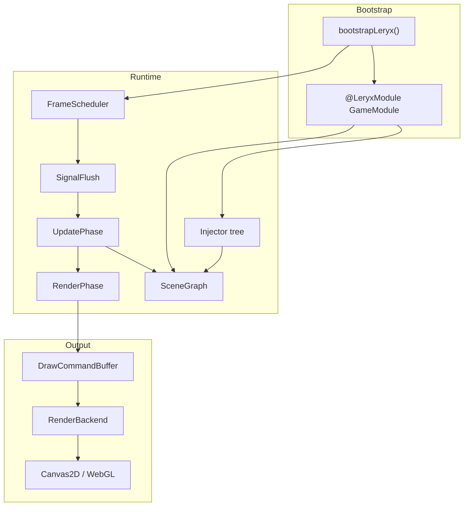
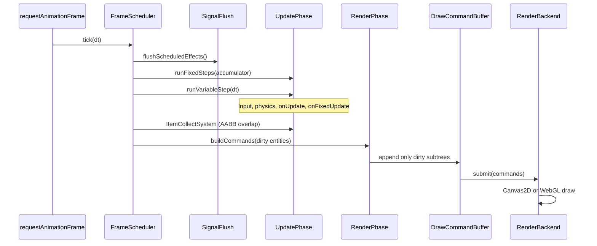
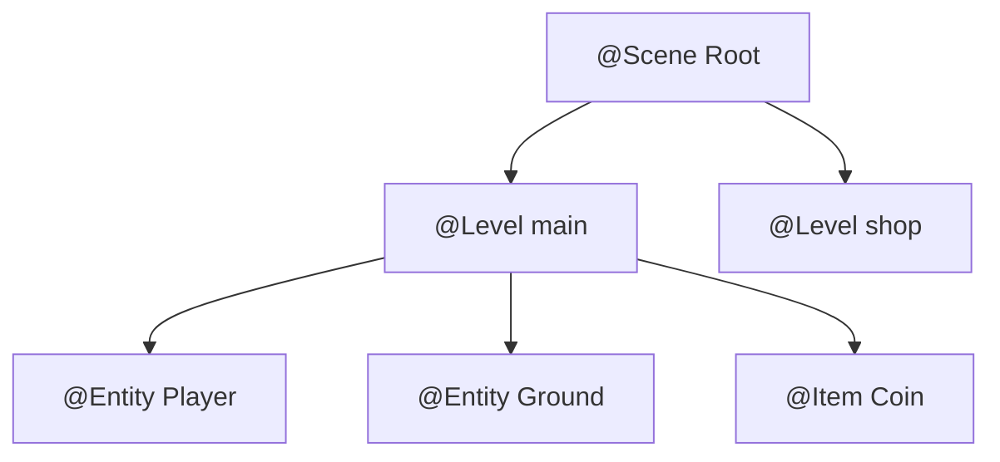
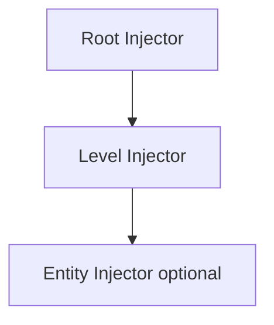

# Core architecture — Leryx Core

This document describes how **@leryx/core** runs a game: the frame scheduler, reactivity integration, object graph, DI, and the **Update / Render** split.

## High-level component diagram



## Game loop meets reactivity

`requestAnimationFrame` drives a single **`FrameScheduler.tick(dt)`** per display frame. Reactivity is **not** a separate thread; it is **phase 0** of the same tick.



### Why this order?

1. **Signal effects first** — UI/game reactions to state changes apply before physics/input for this frame (configurable later via `scheduleEffect` priority).
2. **Fixed update** — deterministic simulation steps (`onFixedUpdate`) with accumulated `dt`.
3. **Variable update** — frame-rate dependent logic (`onUpdate`), input edge detection.
4. **Render last** — reads **committed** transforms/visual state; only entities in `DirtySet` emit commands (static entities skip redraw until explicitly marked dirty again).

Static entities are marked dirty once in `EntityHost.start()`. Dynamic entities mark dirty in `onFixedUpdate` / `onUpdate` or via `trackVisualEffect()`.

### Connecting signals to the loop

| Mechanism                 | Role                                                                           |
| ------------------------- | ------------------------------------------------------------------------------ |
| `signal()` / `computed()` | Authoritative state on entities and services                                   |
| `effect()`                | Side effects; marks owning entity **dirty** for render when visual deps change |
| `scheduleEffect(fn)`      | Defers effect to SignalFlush (batch DOM-like updates)                          |
| `batch()`                 | Coalesce multiple signal writes → one dirty pass                               |

Angular `computed` and Preact `computed` behave the same here: derived values re-run when dependencies change during flush.

## Scene, Level, Entity, Item



| Type       | Responsibility                                                               | Lifetime         |
| ---------- | ---------------------------------------------------------------------------- | ---------------- |
| **Scene**  | Owns active level, global injector, canvas binding                           | App lifetime     |
| **Level**  | Entity tree root, level-scoped providers, load/unload                        | Loaded on demand |
| **Entity** | Gameplay + visual metadata, lifecycle, children                              | Level lifetime   |
| **Item**   | Specialized entity (pickup, inventory); may use `@Item` metadata for systems | Entity lifetime  |

**Scene** is not a “screen” — it is the **runtime host** (like Angular root). **Level** is closer to a routed feature module or game stage.

## Modules and dependency injection

### Metadata registry (no reflect-metadata)

TC39 Stage 3 decorators attach metadata via **`LeryxMetadataRegistry`**:

```typescript
// Conceptual — actual API in packages/core/src/di/
const entityMeta = registry.getEntity(PlayerCube);
// { selector, providers, inputs, ... }
```

Decorators are thin: they only **register** class metadata at module load time.

### Injector hierarchy



- **Root:** singletons (`InputService`, `AssetService`).
- **Level:** spawns when `@Level` loads; destroyed on `onUnload`.
- **Entity:** optional per-entity scope for local state (rare; prefer signals on entity).

`inject(Token)` resolves from the **current construction context** (entity `onInit`, factory, etc.).

### @LeryxModule

```typescript
@LeryxModule({
    imports: [PhysicsModule],
    providers: [InputService],
    declarations: [PlayerCube, Ground],
})
export class GameModule {}
```

- `imports` — compose other modules.
- `providers` — DI bindings.
- `declarations` — register `@Entity` / `@Level` / `@Item` classes.

## Update vs Render isolation

### UpdatePhase owns mutation

Allowed:

- Changing signals.
- Transform integration (velocity → position).
- Input state machine.
- Spawning/destroying entities (deferred to phase end).
- Lifecycle: `onFixedUpdate`, `onUpdate`.

Forbidden:

- Direct `CanvasRenderingContext2D` access.
- Allocating draw commands.

### RenderPhase owns observation

Allowed:

- Read `Transform`, `Sprite`, `Color`, `Text` components (metadata-driven).
- Emit `DrawCommand` variants: `Rect`, `Sprite`, `Text`, later `Mesh`.

Forbidden:

- Gameplay rules, random loot rolls, damage calculation.

### Dirty tracking

When an `effect()` or signal write touches a **visual dependency** (`transform`, `sprite`, `opacity`), the entity id enters **`DirtySet`**. `RenderPhase` walks from dirty nodes upward to rebuild only affected command subtrees.

## RenderBackend abstraction (2D now, 3D-ready)

```typescript
/** packages/core/src/renderer/types.ts (contract) */
export interface RenderBackend {
    readonly kind: 'canvas2d' | 'webgl';
    beginFrame(viewport: Viewport): void;
    submit(commands: readonly DrawCommand[]): void;
    endFrame(): void;
}

export type DrawCommand =
    | { type: 'rect'; x: number; y: number; w: number; h: number; fill: string }
    | { type: 'sprite'; texture: TextureHandle; transform: Matrix3 }
    | { type: 'text'; content: string; x: number; y: number; style: TextStyle };
```

- **M1:** `Canvas2DBackend` implements `rect` / basic `text`.
- **M3:** `WebGLBackend` consumes the same buffer (sprite batching).

3D extension: add `Matrix4`, `Mesh` commands without changing UpdatePhase contracts.

## Input pipeline

`InputService` (@Injectable) normalizes keyboard/pointer/gamepad into **edge-triggered** and **level** events during UpdatePhase start. Entities read input via injection or signals updated by the service — not via raw `window` listeners in entity code.

## Lifecycle integration

| Phase      | Entity hooks                | Level hooks            |
| ---------- | --------------------------- | ---------------------- |
| Load       | —                           | `onLoad`               |
| Activate   | `onInit` → `onStart`        | `onActivate`           |
| Running    | `onUpdate`, `onFixedUpdate` | `onPause` / `onResume` |
| Deactivate | `onDisable`, `onDestroy`    | `onUnload`             |

`onInit` is the only phase where **`useHook()`** is valid (see [framework-syntax.md](framework-syntax.md)).

## Error handling & dev mode

- Entity exceptions in Update are caught and logged; optional **freeze** in dev (M4 + `@leryx/overlays`).
- Render errors must not corrupt Update state — backend resets clip/transform stack per frame.

## Package boundary

Everything above lives in **`@leryx/core`**. Networking (`@leryx/server`) and debug overlays (`@leryx/overlays`) hook via:

- DI tokens (`NETWORK_ADAPTER`).
- Scheduler plugins (post-Update hooks) — defined in later milestones.

See [source-layout.md](source-layout.md) for folder mapping.
