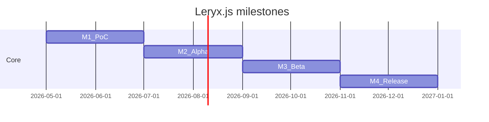
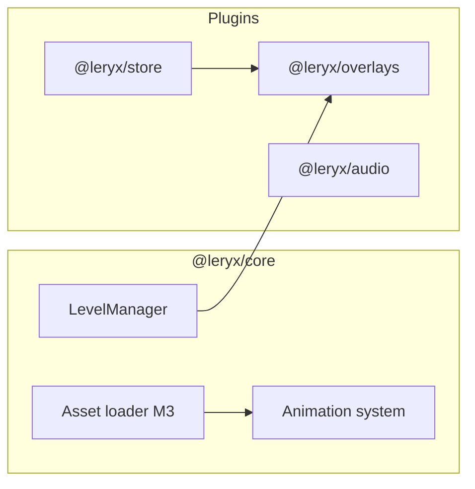
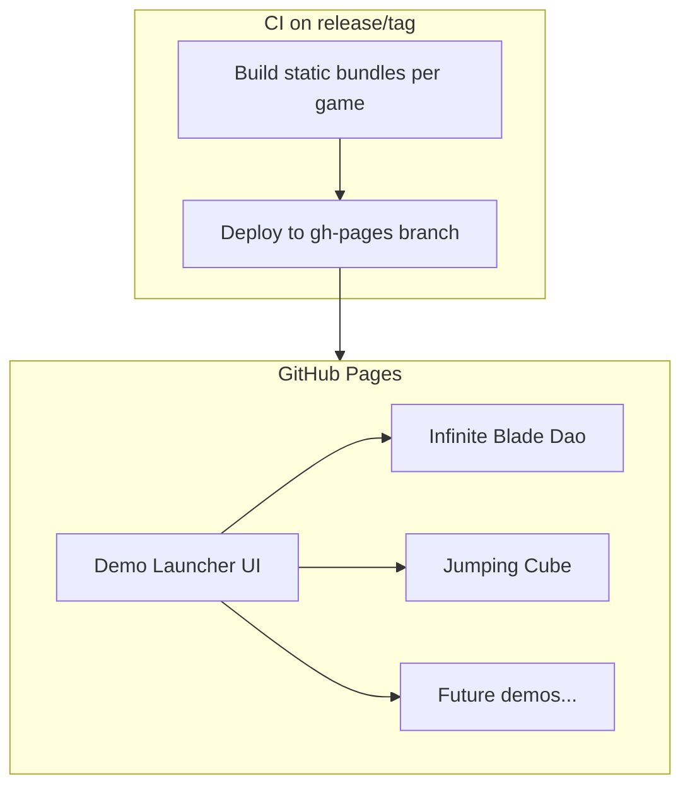

# Roadmap — Leryx.js to v1.0

Versioning is **per package** in the monorepo (`@leryx/core`, `@leryx/server`, …). Tags and publish rules: [publishing.md](publishing.md).

## Overview

| Milestone      | Target `@leryx/core` | Theme                                   |
| -------------- | -------------------- | --------------------------------------- |
| **M1 — PoC**   | `0.1.x`              | Loop, DI, decorators, Canvas2D, signals |
| **M2 — Alpha** | `0.3.x`              | Physics, input, level loading           |
| **M3 — Beta**  | `0.7.x`              | WebGL, assets, overlays plugin          |
| **M4 — 1.0**   | `1.0.0`              | Server stub, DevTools, user docs        |

---

## Milestone 1 — PoC

**Goal:** Prove the declarative model runs at 60fps for a trivial game.

### Deliverables

- [x] `bootstrapLeryx()` — module → scene → scheduler
- [x] `LeryxMetadataRegistry` + Stage 3 decorators (`@LeryxModule`, `@Entity`, `@Level`, `@Scene`)
- [x] Root `Injector` + `inject()`
- [x] `FrameScheduler` + `requestAnimationFrame`
- [x] Signal flush integrated before Update
- [x] `UpdatePhase` / `RenderPhase` separation
- [x] `Canvas2DBackend` — `rect` draw commands
- [x] Entity lifecycle: `onInit`, `onFixedUpdate`, `onDestroy`
- [x] `useHook` + `effect()` in `onInit`
- [x] Keyboard input via `@Injectable` `InputService`
- [x] Sample: jumping cube (see [framework-syntax.md](framework-syntax.md))
- [x] Publish `@leryx/core@0.1.0` to npm

### Out of scope

- WebGL, multiplayer, overlays, gamepad, level editor.

### Done when

- `npm run verify` green.
- Demo runs in browser: cube jumps on Space, stable 60fps on mid-tier laptop.
- Internal docs match implemented API (no major drift).

---

## Milestone 2 — Alpha

**Goal:** Playable small 2D prototype with real input and physics hooks.

### Deliverables

- [x] Fixed timestep accumulator (configurable Hz)
- [x] `onUpdate` + `onFixedUpdate` contract enforced in scheduler
- [x] `LevelManager` — load/unload `@Level`, lifecycle `onLoad` / `onUnload`
- [x] Pointer / touch normalized in `InputService`
- [x] `math/aabb` + simple AABB collision resolver (no external physics engine)
- [x] Plugin-ready physics API surface (interfaces for future `@leryx/physics`)
- [x] `@Item` decorator + collect handler
- [x] Unit tests: scheduler ordering, DI tree, dirty render set
- [x] `@leryx/core@0.3.0`

### Done when

- Second demo: cube collects coins, level transition works.
- Test coverage for runtime critical paths (>70% lines in `runtime/`).

### M2 follow-ups (deferred)

Polish items identified after Alpha; not blockers for M3.

| Item                                                                                   | Why deferred                                                           |
| -------------------------------------------------------------------------------------- | ---------------------------------------------------------------------- |
| `LevelManager.getActiveLevel()` instance accessor                                      | Nice DX; not required for demos                                        |
| Configurable collector role token (replace hardcoded `player-cube` / `role: 'player'`) | API design fits better with entity pooling in M3                       |
| Document `MAX_FRAME_DELTA` vs `maxFixedStepsPerFrame` interaction                      | Docs pass; no runtime change                                           |
| `entity/` module (`transform.ts`, component storage)                                   | Post-Alpha architecture; see [source-layout.md](source-layout.md)      |
| Wire `setSignalFlushCallback` for batch dirty propagation                              | Optional; `trackVisualEffect` + `EntityHost.start()` cover Alpha demos |
| npm publish `@leryx/core@0.3.0`                                                        | Separate step per [publishing.md](publishing.md)                       |

---

## Milestone 3 — Beta

**Goal:** Production-oriented rendering and debug tooling.

### Deliverables

- [ ] `WebGLBackend` implementing same `DrawCommand` buffer
- [ ] Sprite batching + texture atlas stub
- [ ] Asset loader service (images, JSON spritesheets)
- [ ] `Matrix3` / camera2d in `math/`
- [ ] `@leryx/overlays` debug overlay PoC — FPS counter, entity bounds (full package roadmap: [plugins/overlays/roadmap.md](../../plugins/overlays/roadmap.md))
- [ ] Performance budget doc (max draw calls, signal flush cost)
- [ ] `@leryx/core@0.7.0`, `@leryx/overlays@0.1.0`

### Done when

- Same jumping-cube demo runs on Canvas2D and WebGL backends via config flag.
- Overlays attach without modifying game module code (DI token registration).

---

## Milestone 4 — Release 1.0

**Goal:** Stable API, contributor-ready repo, minimal ecosystem.

### Deliverables

- [ ] Semver-stable public API for `@leryx/core`
- [ ] User documentation in `docs/` (getting started, API reference)
- [ ] `@leryx/server` plugin — transport-agnostic net sync **stub** + sample host/client loop
- [ ] DevTools (`@leryx/overlays`): scene graph inspector + **level/scene flow graph** (menu→menu, location→location transitions)
- [ ] CI publish green for all packages
- [ ] Migration guide from 0.7 → 1.0
- [ ] `@leryx/core@1.0.0`

### Done when

- npm downloads install without peer dep warnings for documented stack.
- CHANGELOG for 1.0.0 complete.
- Two external contributors can fix a labeled “good first issue” using only `docs/internals/`.

---

## Post-1.0 — Engine capabilities

**Goal:** Features every real game needs beyond the M4 API — animation, global state, UI overlays, audio, persistence.

**Status:** Planned — not scheduled until after `@leryx/core@1.0.0`.

### Entity animation (`@leryx/core`)

Builds on M3 spritesheets and `DrawCommand` type `sprite`.

| Deliverable                               | Description                                                         |
| ----------------------------------------- | ------------------------------------------------------------------- |
| Spritesheet asset                         | JSON: frames, pivot, events (`footstep`, `hit`)                     |
| `AnimationClip` / `AnimationStateMachine` | Clips: idle, run, jump; transitions from flags (grounded, velocity) |
| Entity integration                        | Metadata on `@Entity`; tick in `onUpdate`, frame in RenderPhase     |
| Demo upgrade                              | Jumping cube → stickman with run loop + jump one-shot               |

**Dependencies:** M3 asset loader + sprite batching. M3 may ship a stub only; full FSM is Post-1.0.

**Rule:** animation mutates visual state only (frame index, flip); gameplay stays in signals / physics.

### Application state store (`@leryx/store`)

NGXS-style plugin — **not** part of core.

- **Extensible state model** — developers declare **custom** `@State` / feature modules; built-in slices (`GameSettingsState`, `InventoryState`, `PlayerProgressState`) are **reference implementations** and optional presets only
- **Actions** — sole write path (immutable patches or reducers)
- **Selectors** — memoized reads for UI and entities (`computed()`-friendly)
- **DevTools hook** — action log, time-travel preview (via `@leryx/overlays` DevTools layer)
- **Client persistence** — sync to **browser storage** (`localStorage` default; optional `sessionStorage`, IndexedDB for large saves). Middleware: hydrate on bootstrap, debounced write on action. No cloud in v1

**Coexistence with signals:** entity-local state stays in signals; store holds **global / cross-level** data (settings, inventory, meta-progress). Document the boundary clearly in user docs.

**Target:** `@leryx/store@0.1.0`.

### `@leryx/overlays` — three layers

Single package; details in [plugins/overlays/roadmap.md](../../plugins/overlays/roadmap.md).

| Layer             | Purpose                                | Examples                                                       |
| ----------------- | -------------------------------------- | -------------------------------------------------------------- |
| **DevTools**      | Developer panels, structure inspection | Scene graph; **level/scene flow graph**; store action log      |
| **Debug overlay** | In-game runtime HUD for developers     | FPS, frame time, draw calls; **configurable widget dashboard** |
| **Game UI**       | Player-facing interface                | Menus, inventory, hotbar, health bar                           |

M3/M4: debug overlay PoC + DevTools foundation. Post-1.0: configurable metrics, game UI primitives.

### Cross-cutting systems

| System                   | Why                             | Home                                        | Priority |
| ------------------------ | ------------------------------- | ------------------------------------------- | -------- |
| **Audio**                | Music, SFX, UI sounds           | `@leryx/audio` or `AudioService` in core    | P0       |
| **Settings**             | Volume, controls, quality       | `@leryx/store` + overlays Game UI           | P0       |
| **Save / load**          | Progress, inventory             | `@leryx/store` → `localStorage` / IndexedDB | P0       |
| **Scene / flow**         | Menu → game → pause → game over | `LevelManager` + `@Level` screens           | P0       |
| **Camera 2D**            | Follow, bounds, shake           | `@leryx/core` math + service                | P1       |
| **Particles / VFX**      | Hits, trails, loot              | `@leryx/core` or plugin                     | P1       |
| **Dialog / narrative**   | NPC, quests                     | `@leryx/overlays` Game UI                   | P2       |
| **Localization**         | i18n                            | `@leryx/i18n` stub or store + JSON          | P2       |
| **Input**                | Gamepad, rebind                 | `InputService` extension                    | P1       |
| **Object pooling**       | Bullets, enemies                | `@leryx/core` utility                       | P1       |
| **Event bus**            | Decoupling without store        | `GameEvents` in core                        | P2       |
| **Time control**         | Pause, slow-mo                  | Scheduler + Level `onPause`                 | P1       |
| **Tilemap / grid**       | Platformers, survivors          | Level data post-Alpha                       | P2       |
| **Achievements / stats** | Meta progression                | Custom store slices                         | P3       |
| **Networking**           | Co-op                           | `@leryx/server`                             | Post-1.0 |

### Post-1.0 package versions (orienting)

| Package           | Versions                                                               |
| ----------------- | ---------------------------------------------------------------------- |
| `@leryx/core`     | `1.1.x` — animation, camera, pooling                                   |
| `@leryx/overlays` | `0.1` M3 debug overlay; `0.2` M4 DevTools + flow graph; `0.3+` Game UI |
| `@leryx/store`    | `0.1`                                                                  |
| `@leryx/audio`    | `0.1`                                                                  |

---

## Post-1.0 — Reference game: Infinite Blade Dao

**Goal:** End-to-end showcase game built on stable `@leryx/core` — validates the public API beyond milestone demos.

| Field            | Value                                                                            |
| ---------------- | -------------------------------------------------------------------------------- |
| **Title**        | Infinite Blade Dao                                                               |
| **Path**         | `games/infinite-blade-dao/`                                                      |
| **Game roadmap** | [games/infinite-blade-dao/roadmap.md](../../games/infinite-blade-dao/roadmap.md) |
| **Genre**        | Top-down survivor / horde (Brotato-like)                                         |
| **Setting**      | Chinese manhua / xianxia: cultivation, flying swords, qi, inner power            |
| **Start**        | After `@leryx/core@1.0.0` (M4)                                                   |
| **Current**      | G0 — design stub                                                                 |

### Deliverables

- [ ] Playable web build on `@leryx/core`
- [ ] Full survivor loop (waves → upgrade choice → stat progression)
- [ ] Smoke test run (5–10 min); featured in user docs

See [games/infinite-blade-dao/roadmap.md](../../games/infinite-blade-dao/roadmap.md) for phases G0–G4.

### Out of scope (v1)

- Multiplayer, procedural maps, full balance pass, localization.

### Done when

- Game runs from monorepo via a single dev command.
- Demonstrates key 1.0 features without deep imports into core.
- Mentioned in user getting-started guide.

---

## Post-1.0 — Demo launcher (GitHub Pages)

**Goal:** Public GitHub Pages site — a “launcher” / library of interactive Leryx.js demos. Users open the site, browse game/demo cards, and play in the browser without a local build.

**Status:** Vision only — not implemented until post-M4.

### Planned deliverables

- [ ] Static site shell — grid/list of cards: title, screenshot, description, “Play” button
- [ ] CI workflow: build `games/*` + milestone demos → deploy to GitHub Pages
- [ ] Infinite Blade Dao as flagship launcher entry
- [ ] Milestone demos from M1–M3 (jumping cube, coin collector) as separate cards over time

**Likely location (TBD):** `apps/demo-launcher/` or `sites/playground/` — folder not created yet.

### Out of scope (v1 launcher)

- Accounts, cloud saves, embed SDK for third-party repos.

### Done when

- `https://<org>.github.io/leryx/` (or custom domain) opens the launcher.
- At least 2 playable demos from the monorepo.
- Linked from root README and user docs.

**Dependency:** stable `@leryx/core@1.0.0` + at least one full game build (Infinite Blade Dao G2+).

---

## Package release matrix

| Package           | M1  | M2  | M3  | M4  | Post-1.0 |
| ----------------- | --- | --- | --- | --- | -------- |
| `@leryx/core`     | 0.1 | 0.3 | 0.7 | 1.0 | 1.1.x    |
| `@leryx/overlays` | —   | —   | 0.1 | 0.2 | 0.3+     |
| `@leryx/server`   | —   | —   | —   | 0.1 | —        |
| `@leryx/store`    | —   | —   | —   | —   | 0.1      |
| `@leryx/audio`    | —   | —   | —   | —   | 0.1      |

---

## Risks & mitigations

| Risk                                          | Mitigation                                                               |
| --------------------------------------------- | ------------------------------------------------------------------------ |
| Stage 3 decorator breakage across TS versions | Pin minimum TS in peer docs; CI matrix on TS 5.2 / 5.9                   |
| Signal flush cost per frame                   | `scheduleEffect` batching; benchmark in M3                               |
| WebGL scope creep                             | Same command buffer as Canvas2D                                          |
| Workspace publish misconfiguration            | Automated tag/version check in `publish.yml`                             |
| Store vs signals confusion for new users      | Document boundaries; entity-local = signals, global = store              |
| Overlays: three layers in one package         | Separate entry points (`/debug`, `/devtools`, `/ui`); tree-shake in prod |

---

## Current status (repository bootstrap)

- Monorepo scaffold + npm workspaces: **done**
- Internal documentation: **done**
- **Milestone 1 — PoC:** **done** (`@leryx/core@0.1.0`, jumping-cube demo in `demos/jumping-cube/`)
- **Milestone 2 — Alpha:** **done** (`@leryx/core@0.3.0`, coin-collector demo in `demos/coin-collector/`)

Next engineering task: **Milestone 3 — Beta** (WebGL backend, asset loader, overlays debug PoC).
