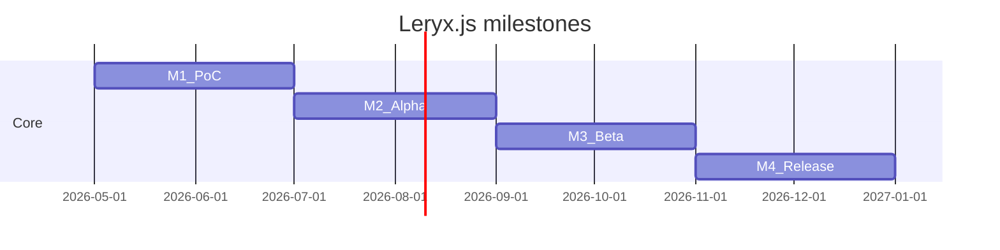

# Roadmap — Leryx.js to v1.0

Versioning is **per package** in the monorepo (`@leryx/core`, `@leryx/server`, …). Tags and publish rules: [publishing.md](publishing.md).

## Overview

| Milestone      | Target `@leryx/core` | Theme                                   |
| -------------- | -------------------- | --------------------------------------- |
| **M1 — PoC**   | `0.1.x`              | Loop, DI, decorators, Canvas2D, signals |
| **M2 — Alpha** | `0.3.x`              | Physics, input, level loading           |
| **M3 — Beta**  | `0.7.x`              | WebGL, assets, overlays plugin          |
| **M4 — 1.0**   | `1.0.0`              | Server stub, DevTools, user docs        |

---

## Milestone 1 — PoC

**Goal:** Prove the declarative model runs at 60fps for a trivial game.

### Deliverables

- [ ] `bootstrapLeryx()` — module → scene → scheduler
- [ ] `LeryxMetadataRegistry` + Stage 3 decorators (`@LeryxModule`, `@Entity`, `@Level`, `@Scene`)
- [ ] Root `Injector` + `inject()`
- [ ] `FrameScheduler` + `requestAnimationFrame`
- [ ] Signal flush integrated before Update
- [ ] `UpdatePhase` / `RenderPhase` separation
- [ ] `Canvas2DBackend` — `rect` draw commands
- [ ] Entity lifecycle: `onInit`, `onFixedUpdate`, `onDestroy`
- [ ] `useHook` + `effect()` in `onInit`
- [ ] Keyboard input via `@Injectable` `InputService`
- [ ] Sample: jumping cube (see [framework-syntax.md](framework-syntax.md))
- [ ] Publish `@leryx/core@0.1.0` to npm

### Out of scope

- WebGL, multiplayer, overlays, gamepad, level editor.

### Done when

- `npm run verify` green.
- Demo runs in browser: cube jumps on Space, stable 60fps on mid-tier laptop.
- Internal docs match implemented API (no major drift).

---

## Milestone 2 — Alpha

**Goal:** Playable small 2D prototype with real input and physics hooks.

### Deliverables

- [ ] Fixed timestep accumulator (configurable Hz)
- [ ] `onUpdate` + `onFixedUpdate` contract enforced in scheduler
- [ ] `LevelManager` — load/unload `@Level`, lifecycle `onLoad` / `onUnload`
- [ ] Pointer / touch normalized in `InputService`
- [ ] `math/aabb` + simple AABB collision resolver (no external physics engine)
- [ ] Plugin-ready physics API surface (interfaces for future `@leryx/physics`)
- [ ] `@Item` decorator + collect handler
- [ ] Unit tests: scheduler ordering, DI tree, dirty render set
- [ ] `@leryx/core@0.3.0`

### Done when

- Second demo: cube collects coins, level transition works.
- Test coverage for runtime critical paths (>70% lines in `runtime/`).

---

## Milestone 3 — Beta

**Goal:** Production-oriented rendering and debug tooling.

### Deliverables

- [ ] `WebGLBackend` implementing same `DrawCommand` buffer
- [ ] Sprite batching + texture atlas stub
- [ ] Asset loader service (images, JSON spritesheets)
- [ ] `Matrix3` / camera2d in `math/`
- [ ] `@leryx/overlays` plugin PoC — FPS graph, entity bounds
- [ ] Performance budget doc (max draw calls, signal flush cost)
- [ ] `@leryx/core@0.7.0`, `@leryx/overlays@0.1.0`

### Done when

- Same jumping-cube demo runs on Canvas2D and WebGL backends via config flag.
- Overlays attach without modifying game module code (DI token registration).

---

## Milestone 4 — Release 1.0

**Goal:** Stable API, contributor-ready repo, minimal ecosystem.

### Deliverables

- [ ] Semver-stable public API for `@leryx/core`
- [ ] User documentation in `docs/` (getting started, API reference)
- [ ] `@leryx/server` plugin — transport-agnostic net sync **stub** + sample host/client loop
- [ ] DevTools: scene graph inspector (overlays + core hooks)
- [ ] CI publish green for all packages
- [ ] Migration guide from 0.7 → 1.0
- [ ] `@leryx/core@1.0.0`

### Done when

- npm downloads install without peer dep warnings for documented stack.
- CHANGELOG for 1.0.0 complete.
- Two external contributors can fix a labeled “good first issue” using only `docs/internals/`.

---

## Package release matrix

| Package           | M1  | M2  | M3  | M4  |
| ----------------- | --- | --- | --- | --- |
| `@leryx/core`     | 0.1 | 0.3 | 0.7 | 1.0 |
| `@leryx/overlays` | —   | —   | 0.1 | 0.3 |
| `@leryx/server`   | —   | —   | —   | 0.1 |

---

## Risks & mitigations

| Risk                                          | Mitigation                                             |
| --------------------------------------------- | ------------------------------------------------------ |
| Stage 3 decorator breakage across TS versions | Pin minimum TS in peer docs; CI matrix on TS 5.2 / 5.9 |
| Signal flush cost per frame                   | `scheduleEffect` batching; benchmark in M3             |
| WebGL scope creep                             | Same command buffer as Canvas2D                        |
| Workspace publish misconfiguration            | Automated tag/version check in `publish.yml`           |

---

## Current status (repository bootstrap)

- Monorepo scaffold + npm workspaces: **done**
- Internal documentation: **done**
- Runtime implementation: **not started** (stubs throw / export version only)

Next engineering task: **Milestone 1 — PoC** starting with `FrameScheduler` and metadata registry.
