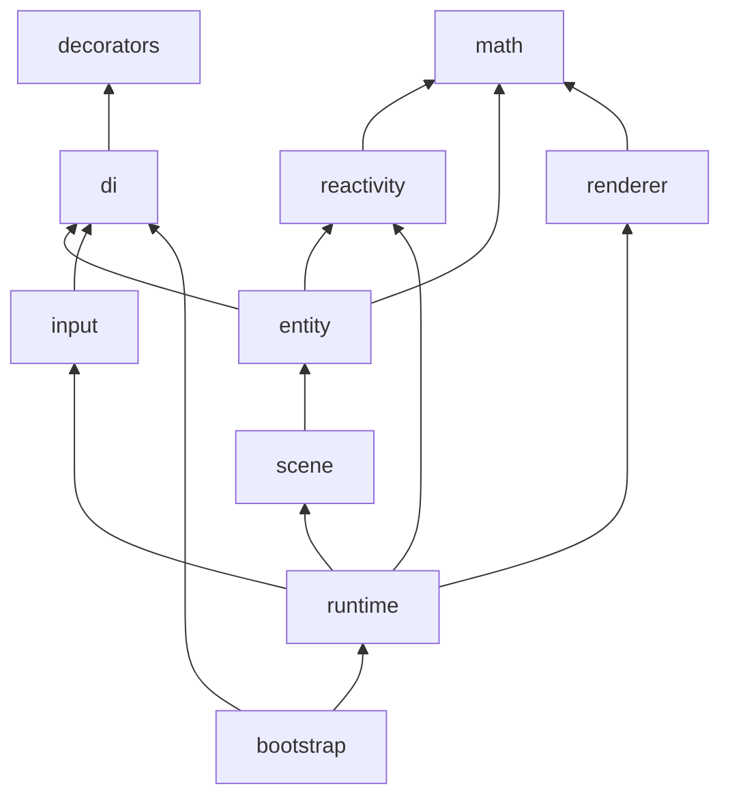

# Source layout — monorepo & engine folders

## Repository tree

```
leryx/                          # private npm workspace root
├── package.json                # workspaces: packages/*, plugins/*
├── package-lock.json           # single lockfile
├── tsconfig.base.json
├── tsconfig.json               # project references
├── tsconfig.eslint.json        # path aliases for ESLint
├── vitest.config.ts
├── eslint.config.js
├── packages/
│   └── core/                   # @leryx/core
│       ├── package.json
│       ├── tsconfig.json
│       ├── src/
│       └── tests/
├── plugins/
│   ├── server/                 # @leryx/server
│   ├── overlays/               # @leryx/overlays
│   └── README.md
├── games/                        # reference games (not npm workspaces until G1)
│   ├── README.md
│   └── infinite-blade-dao/       # flagship survivor demo (post-M4)
│       ├── README.md             # setting & design
│       └── roadmap.md            # G0–G4 game phases
├── apps/                         # (future) demo-launcher for GitHub Pages — not created yet
├── docs/
│   ├── README.md               # user docs (stub)
│   └── internals/              # this folder
└── .github/workflows/
    ├── ci.yml
    └── publish.yml
```

## npm workspaces

| Command                        | Purpose                                |
| ------------------------------ | -------------------------------------- |
| `npm install`                  | Install all workspaces + hoist devDeps |
| `npm run build -w @leryx/core` | Build one package                      |
| `npm run build:all`            | All packages with a `build` script     |
| `npm publish -w @leryx/server` | Publish from repo root                 |

**Linking:** plugins use `"@leryx/core": "<core-version>"` in `dependencies` (workspace symlink) and a range in `peerDependencies`. See [publishing.md](publishing.md).

### Why workspaces (vs separate lockfiles)

- One `npm ci` in CI.
- Core changes are immediately visible to plugins without `file:../..`.
- Shared TypeScript, ESLint, Vitest at the root.

## `packages/core/src/` — planned module layout

Current stub: `index.ts`, `reactivity/index.ts`. Target structure for implementation:

```
packages/core/src/
├── index.ts                 # Public API barrel
├── bootstrap.ts             # bootstrapLeryx()
├── reactivity/
│   ├── index.ts             # Re-exports + scheduleEffect
│   └── hooks.ts             # useHook, effect context
├── di/
│   ├── injector.ts
│   ├── metadata-registry.ts
│   ├── tokens.ts
│   └── decorators.ts        # Injectable, LeryxModule
├── decorators/
│   ├── scene.ts             # @Scene
│   ├── level.ts             # @Level
│   ├── entity.ts            # @Entity
│   └── item.ts              # @Item
├── runtime/
│   ├── frame-scheduler.ts
│   ├── update-phase.ts
│   ├── render-phase.ts
│   ├── dirty-set.ts
│   └── lifecycle.ts
├── scene/
│   ├── scene-graph.ts
│   ├── level-manager.ts
│   └── entity-host.ts
├── entity/
│   ├── entity-instance.ts
│   └── transform.ts
├── input/
│   └── input-service.ts
├── renderer/
│   ├── types.ts             # DrawCommand, RenderBackend
│   ├── command-buffer.ts
│   └── canvas2d-backend.ts
└── math/
    ├── vec2.ts
    ├── aabb.ts
    └── matrix3.ts            # 3D: matrix4.ts later
```

## Folder responsibilities

| Folder           | Responsibility                                      |
| ---------------- | --------------------------------------------------- |
| **`bootstrap`**  | Wire module → scene → scheduler → canvas            |
| **`di`**         | Injector tree, provider resolution, `inject()`      |
| **`decorators`** | Stage 3 decorators + metadata registration          |
| **`reactivity`** | Signals wrapper, `useHook`, frame-scheduled effects |
| **`runtime`**    | Game loop phases, timestep, lifecycle dispatcher    |
| **`scene`**      | Scene/Level/Entity tree, load/unload                |
| **`entity`**     | Per-entity instance, transform, component storage   |
| **`input`**      | Normalized input; no raw DOM in entities            |
| **`renderer`**   | Backends only; no gameplay                          |
| **`math`**       | Pure TS math; no DOM; shared by Update and Render   |

## Dependency rules (layering)



**Rules:**

1. `math` and `reactivity` have **no** imports from `runtime` / `renderer`.
2. `renderer` **never** imports `scene` or `entity` types (only read-only DTOs / commands).
3. `decorators` only touch `metadata-registry`, not runtime instances.
4. Plugins (`@leryx/server`, etc.) depend on **public** `@leryx/core` API only — no deep imports into `runtime/`.

## `games/` — reference projects

| Path                         | Role                                      |
| ---------------------------- | ----------------------------------------- |
| `games/infinite-blade-dao/`  | Flagship survivor demo (post-M4)          |
| `games/README.md`            | Index of reference games                  |

- **Not** an npm workspace until G1 (first playable slice).
- Depends on `@leryx/core` via workspace link when `package.json` is added.
- Production builds target the future **demo launcher** on GitHub Pages (`apps/demo-launcher/` — planned, not in repo yet).

## `apps/` — future demo launcher

Placeholder for a static site that lists and launches playable demos from `games/` and milestone samples. Documented in [roadmap.md](roadmap.md#post-10--demo-launcher-github-pages); implementation is post-M4.

## `plugins/` packages

| Package           | Path               | Depends on    | Notes                         |
| ----------------- | ------------------ | ------------- | ----------------------------- |
| `@leryx/server`   | `plugins/server`   | `@leryx/core` | Netcode adapter (M4)          |
| `@leryx/overlays` | `plugins/overlays` | `@leryx/core` | Debug draw, inspector (M3–M4) |

Each plugin:

- Own `tsconfig.json` extending `tsconfig.base.json`.
- `src/index.ts` as public entry.
- Must not duplicate core loop — register via DI tokens / extension points.

## Tests

| Location                | Scope                                    |
| ----------------------- | ---------------------------------------- |
| `packages/core/tests/`  | Unit: scheduler, DI, signals integration |
| `plugins/*/tests/`      | Plugin-specific (when implemented)       |
| Root `vitest.config.ts` | Aliases `@leryx/*` → source              |

## Tooling files

| File                   | Role                                            |
| ---------------------- | ----------------------------------------------- |
| `tsconfig.eslint.json` | Path maps for type-aware lint across workspaces |
| `vitest.config.ts`     | jsdom environment, workspace test globs         |
| `.husky/pre-commit`    | `lint-staged` + `npm run verify`                |

## Adding code — checklist

1. Place file under the correct layer (see dependency rules).
2. Export public API only from `packages/core/src/index.ts` or documented subpaths (`./reactivity`).
3. Update this document if a new top-level folder is added.
4. Add tests adjacent to `packages/core/tests/<area>/`.
