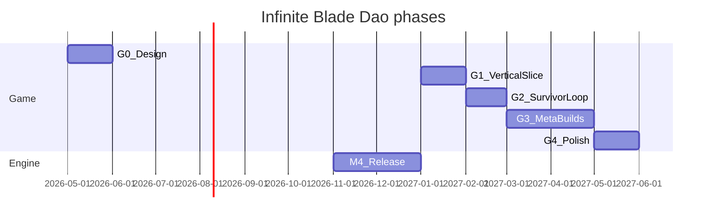

# Roadmap — Infinite Blade Dao

Reference survivor game for [Leryx.js](https://github.com/Leritas/leryx). Design and setting: [README.md](README.md). Engine milestones: [docs/internals/roadmap.md](../../docs/internals/roadmap.md).

**Start of implementation:** after `@leryx/core@1.0.0` (M4).

## Overview

| Phase  | Theme                | Status      |
| ------ | -------------------- | ----------- |
| **G0** | Design stub          | **current** |
| **G1** | Vertical slice       | planned     |
| **G2** | Survivor core loop   | planned     |
| **G3** | Meta & build variety | planned     |
| **G4** | Polish & showcase    | planned     |

Dates are indicative; G1 starts only after engine M4.

---

## G0 — Design

**Goal:** Lock setting, core loop, and v1 scope.

### Deliverables

- [x] [README.md](README.md) — setting, Brotato mapping, planned entities
- [x] This roadmap

### Done when

- Documents live in the repo; main engine roadmap links to this game.

---

## G1 — Vertical slice

**Goal:** One playable minute — movement, one enemy, one flying sword, death and restart.

### Deliverables

- [ ] `package.json` + Vite dev server in `games/infinite-blade-dao/`
- [ ] `@LeryxModule` + `@Level` arena
- [ ] `Cultivator` entity, `FlyingSword`, basic `Demon`
- [ ] Canvas2D placeholder art (rects / colors)

### Engine needs

- M4 stable public API
- M2 collision + input
- M1 game loop

### Done when

- `npm run dev` (workspace script TBD) — locally playable vertical slice.

---

## G2 — Survivor core loop

**Goal:** Brotato-like cycle — enemy waves, timer, game over, basic score.

### Deliverables

- [ ] `WaveSpawner` + escalating waves
- [ ] HP; qi as resource / regen stat
- [ ] Brief pause between waves

### Engine needs

- M2 `@Item` surface
- Signals for HUD stats

### Done when

- 3+ waves in a row without crashes; run ends on death.

---

## G3 — Meta & build variety

**Goal:** Between waves — pick a technique or artifact; multiple viable build paths.

### Deliverables

- [ ] Level-up / shop screen between waves (3 choices)
- [ ] 3+ weapon types: extra swords, qi burst, talisman AoE
- [ ] 3+ enemy archetypes
- [ ] Stat progression: inner power, speed, pierce

### Engine needs

- M3 sprites + asset loader (placeholder sprites OK)

### Done when

- Different builds noticeably change gameplay; a 5–10 min run is possible.

---

## G4 — Polish & showcase

**Goal:** Reference quality for docs and the future GitHub Pages demo launcher.

### Deliverables

- [ ] Sprite art pass (or consistent placeholder set)
- [ ] SFX stub, screen shake / hit feedback
- [ ] `@leryx/overlays` FPS toggle in dev
- [ ] Static production build
- [ ] GIF + description in user docs

### Engine needs

- M3 WebGL backend (optional config flag)
- M4 overlays

### Done when

- Production build ready for GitHub Pages; featured in getting-started.

---

## Backlog (G5+, not v1)

- Tribulation bosses
- Meta-progression between runs
- Mobile touch UX
