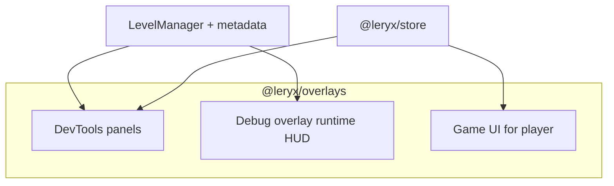

# Roadmap — `@leryx/overlays`

Debug tooling, developer HUD, and player-facing game UI in one plugin package.

**Status:** Stub (`OVERLAYS_PLUGIN_VERSION` only). Phases align with [docs/internals/roadmap.md](../../docs/internals/roadmap.md) milestones M3–M4 and Post-1.0.

## Three layers

| Layer             | Audience                            | When              |
| ----------------- | ----------------------------------- | ----------------- |
| **DevTools**      | Developer (side panel / overlay UI) | M4+               |
| **Debug overlay** | Developer (in-game metrics HUD)     | M3 PoC → Post-1.0 |
| **Game UI**       | Player                              | Post-1.0          |

Separate entry points for tree-shaking in production builds (e.g. `import '@leryx/overlays/debug'` — exact paths TBD).

---

## 1. DevTools

**Goal:** Inspect game structure without reading source — scene tree, level flow, global state.

### Deliverables

- [ ] **Scene graph inspector** — entities in the active `@Level`, hierarchy, active flags
- [ ] **Level / scene flow graph** — visual tree of transitions: menu → settings → main menu; hub → dungeon → boss. Data from metadata registry + `LevelManager` (TBD: explicit `@Level({ transitions })` vs inferred)
- [ ] **Store inspector** — registered states, action log, selector preview (requires `@leryx/store`)
- [ ] **Entity bounds overlay** — debug draw of AABB / hitboxes on canvas

### Done when

- Demo with 2+ menu/location levels shows a readable transition graph in DevTools.

---

## 2. Debug overlay

**Goal:** Lightweight in-game metrics while playtesting — not the same as full DevTools panels.

### Deliverables

- [ ] **FPS counter** (M3 PoC) — attach via DI without editing game module
- [ ] Frame time (ms), draw command count per frame
- [ ] Optional signal-flush cost (when core exposes hook)
- [ ] **Configurable dashboard** — developer toggles widgets (FPS, frame time, …) and layout presets
- [ ] Stripped from production builds via separate import path

### Done when

- Developer enables FPS + frame time in config; both visible during jumping-cube (or successor) demo.

---

## 3. Game UI

**Goal:** Menus, HUD, and inventory for players — driven by `@leryx/store` selectors.

### Menu / screens

- [ ] `OverlayRoot` — DI-registered root above game canvas
- [ ] `Panel`, `Button`, `Label`, `Slider`, `Toggle`
- [ ] Focus / keyboard navigation; pointer hit-test
- [ ] Layout: anchor + flex-like stack on canvas (HTML overlay mode: **TBD**)

### Inventory

- [ ] `InventoryGrid`, `ItemSlot`, `ItemStack` display
- [ ] Drag-and-drop hooks → store actions
- [ ] Tooltip / compare panel

### HUD (Minecraft-like)

- [ ] `Hotbar` — N slots, selected index, cooldown overlay
- [ ] `HealthBar` — hearts or segments
- [ ] `ResourceBar` — mana, stamina, XP
- [ ] `Minimap` stub (optional later phase)

### Integration (open questions)

- **State:** read via `@leryx/store` selectors; custom slices alongside reference presets
- **Input:** Game UI consumes pointer before gameplay `InputService`
- **Render:** separate overlay pass after game `RenderPhase` vs merged draw commands — **TBD**

### Done when

- Pause menu + settings (volume → `GameSettingsState` or custom settings slice) + hotbar in one demo
- Demo also registers a **custom** `@State` to prove extensibility

---

## Phases

| Phase  | Layer         | Target version               | Deliverables                                      |
| ------ | ------------- | ---------------------------- | ------------------------------------------------- |
| **O0** | Debug overlay | `@leryx/overlays@0.1.0` (M3) | FPS counter; DI registration                      |
| **O1** | DevTools      | `@leryx/overlays@0.2.0` (M4) | Scene graph; level flow graph v1; entity bounds   |
| **O2** | Debug overlay | `0.2.x` / Post-1.0           | Configurable metrics dashboard                    |
| **O3** | Game UI       | `0.3.0`                      | `OverlayRoot`, menu primitives, pause screen demo |
| **O4** | Game UI       | `0.3.x`                      | Hotbar + health bar + store selectors             |
| **O5** | Game UI       | `0.4.0`                      | Full inventory grid + drag-drop                   |

---

## Out of scope (v1 overlays)

- Visual UI editor / WYSIWYG
- DOM-only UI framework (may add opt-in HTML layer later)
- Cloud-hosted DevTools

---

## Related docs

- Engine roadmap: [docs/internals/roadmap.md](../../docs/internals/roadmap.md)
- Architecture: [docs/internals/core-architecture.md](../../docs/internals/core-architecture.md)
